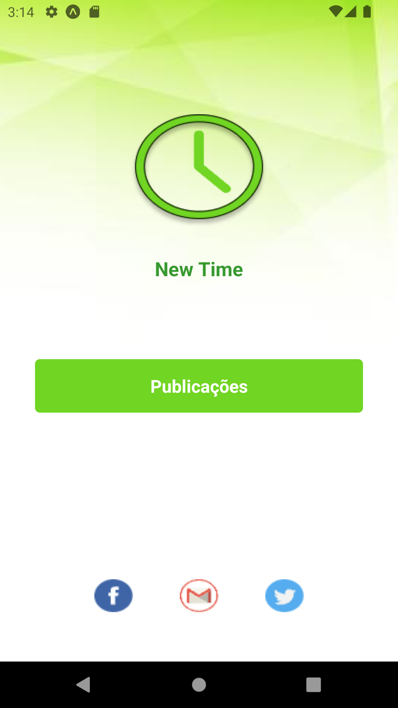
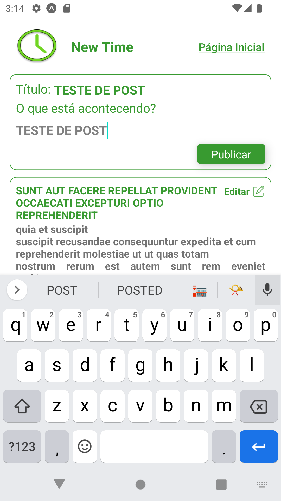
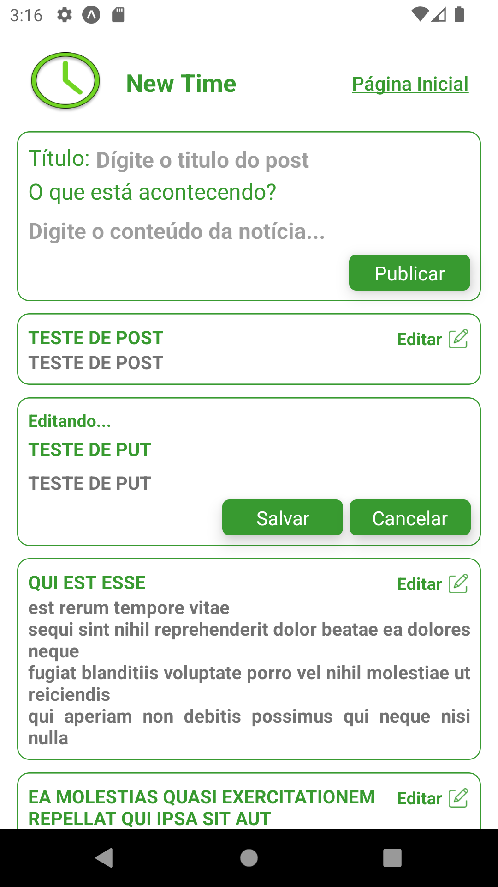
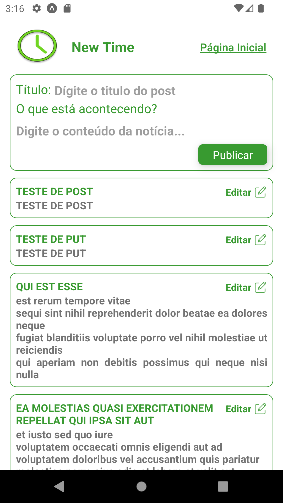
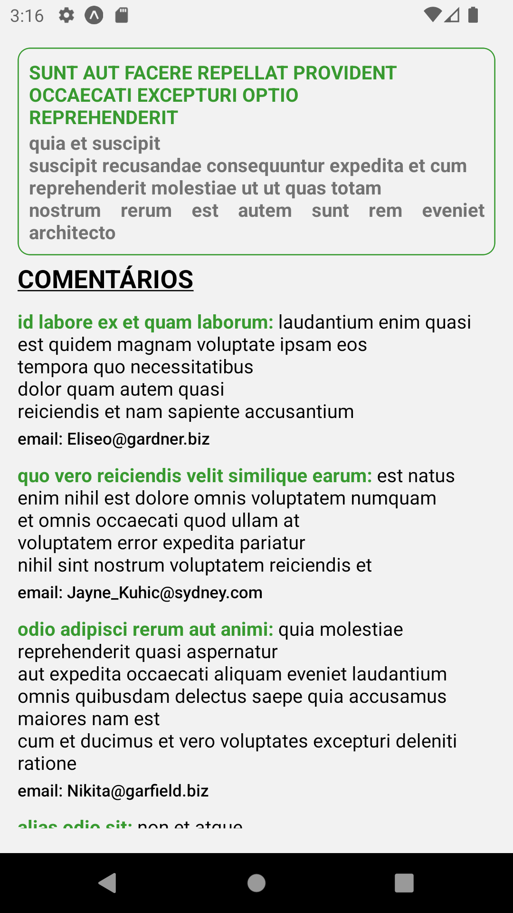
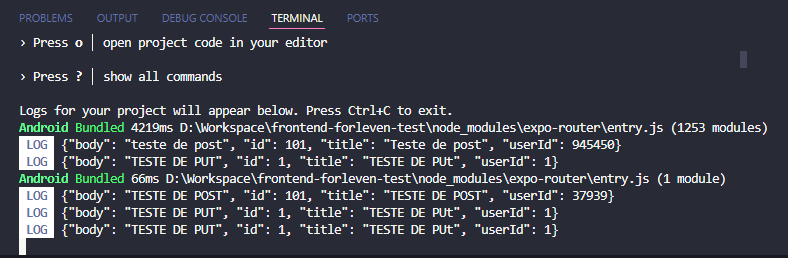
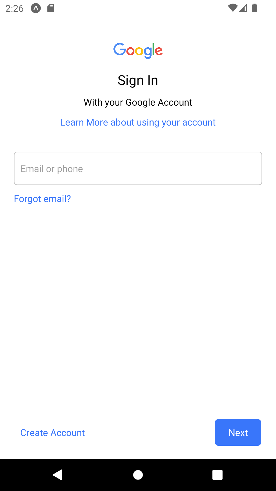
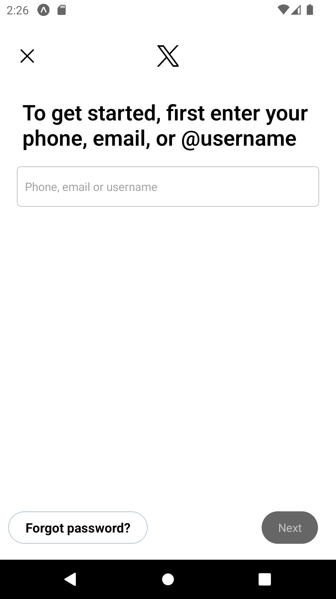

# frontend-forleven-test

<!-- 1405x425 -->


## Sumário

- [\[frontend-forleven-test\]](#frontend-forleven-test)
  - [Sumário](#sumário)
  - [Introdução](#introdução)
  - [Tecnologias Usadas](#tecnologias-usadas)
  - [Snapshots](#snapshots)
  - [Ambiente de desenvolvimento](#ambiente-de-desenvolvimento)
  - [Requisitos](#requisitos)
  - [Informações Técnicas](#informações-técnicas)
  - [Como Executar o Projeto](#como-executar-o-projeto)
  - [Contato](#contato)

## Introdução

Este projeto é um teste aplicado pela forleven para comprovar habilidades básicas com desenvolvimento de software em react native. O objetivo é criar uma listagem de itens e a opção de visualizar detalhes desses itens, onde traria mais informações sobre o item selecionado. Este aplicativo tem o funcionamento integrado com uma API, [JSONPlaceholder](https://jsonplaceholder.typicode.com/).

## Tecnologias Usadas

&nbsp;
&nbsp;

## Ambiente de desenvolvimento

- Virtual Studio Code - Version 1.92.1
- GitHub Desktop - Version 3.4.3
- Node.js - Version 20.12.2
- Android - 12.0 ("S") | x86_64 - API 31 (Emulador)

## Requisitos

- [x] Requisito 1: Fazer uma requisição de **GET** exibindo uma lista de posts de ao menos 10 objetos.
- [x] Requisito 2: Fazer uma requisição de **GET** para exibir comentários do post selecionado da lista anterior.
- [x] Bonus 1: Fazer um formulário contendo as informações necessárias para fazer uma requisição **POST**
- [x] Bonus 1: Fazer uma requisição de **PUT** ou **PATCH** para alterar um item da listagem de posts

## Informações técnicas

- Utilizado React Native;
- Feito as requisições na API https://jsonplaceholder.typicode.com/;
- Utilizado TypeScript;
- Utilizado React Context para estado dos posts
- Utilizado regras e padrões do Prettier;

## Snapshots

### Tela Login

**Importante**: o recurso não será realmente atualizado no servidor da API, mas será falsificado como se fosse.



### Tela Home - Get



### Tela Home - Post


### Tela Home - Put



### Tela Home - Resultado



### Tela Comentários



### Resultado das requisições

Após fazer as requisições **POST** e **PUT** para a API é retornado no console o json do post.
</br>


### Telas redes sociais





## Como Executar o Projeto

Para executar o projeto siga as instruções:

1. Clone o repositório:

```bash
git clone https://github.com/LucasDoGit/facetime
cd facetime
```

2. Instale as dependências:

```bash
npm install
```

3. use o comando abaixo para iniciar o projeto e aguarde.

```bash
npm start
```

4. Usando o [Expo Go](https://expo.dev/go) e leia o QR code em um dispositivo móvel, ou execute um emulador de smartphone como o [Android Studio](https://developer.android.com/studio)

5. Feito! O projeto deve ser iniciado em um aparelho ou emulador.

## Contato

Para obter mais informações, entre em contato comigo em:

- Email: lucas.saiz19@gmail.com
- GitHub: https://github.com/LucasDoGit
